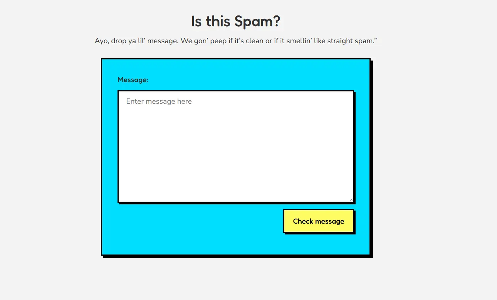

## Spam Filter

A modern take on the classic [FreeCodeCamp JavaScript Algorithms and Data Structures Certification](https://www.freecodecamp.org/learn/javascript-algorithms-and-data-structures-v8/learn-regular-expressions-by-building-a-spam-filter), redesigned with a neobrutalism UI aesthetic. This project filters messages containing spam keywords using JavaScript Regular Expressions and provides instant feedback to the user in a bold, playful interface.

## 📷 Preview

[](https://gusavila.github.io/spam-filter/);

## ✨ Features

- Detects common spam phrases using regular expressions

- Instantly notifies the user if a message is spam

- Clean, playful, and bold neobrutalism-inspired UI

- Responsive design for desktop and mobile


## 💻 Technologies Used

HTML5

CSS3 (Neobrutalism design)

JavaScript (ES6+)

## 🔧 How It Works

1. User types a message in the input field.

2. The JavaScript function isSpam() checks the message against spam patterns using regular expressions.

3. If a spam phrase is detected, a message feedback appears with a warning.

4. If no spam is detected, a message feedback confirms the message is clean.

## 🚀 Getting Started

``` bash
Clone the repo and open index.html in your browser:

1. git clone https://github.com/gusavila/spam-filter.git

2. cd spam-filter

3. start index.html

```

## 🎯 Key Concepts Learned

- Using JavaScript Regular Expressions to detect spam patterns
- Using RegExp.test() for pattern matching
- Handling multiple keywords and case-insensitive matching
- Integrating RegEx checks into a function (isSpam)
- Updating the DOM and CSS dynamically based on RegEx results

## 🤝 Contributing

Pull requests and feedback are welcome! If you spot bugs or have ideas to enhance the UI/UX, feel free to submit a PR.

## 📚 Acknowledgments

[FreeCodeCamp](https://www.freecodecamp.org/) for providing the project idea and guidance.